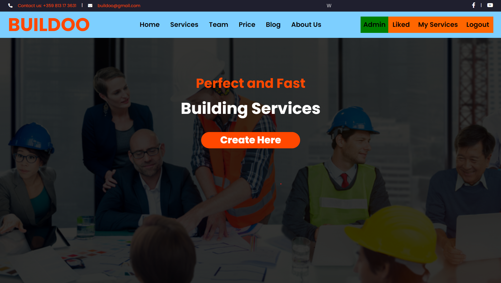
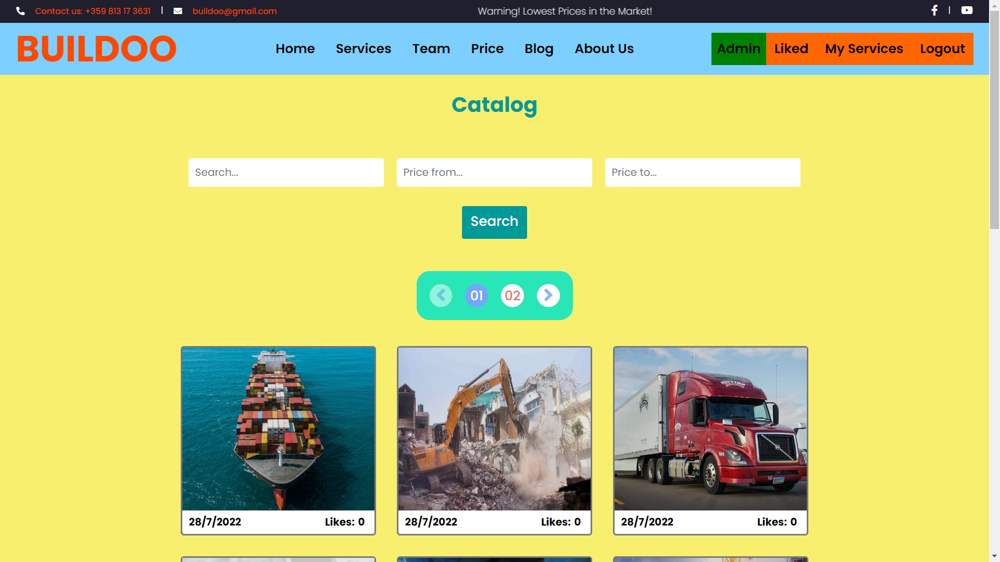
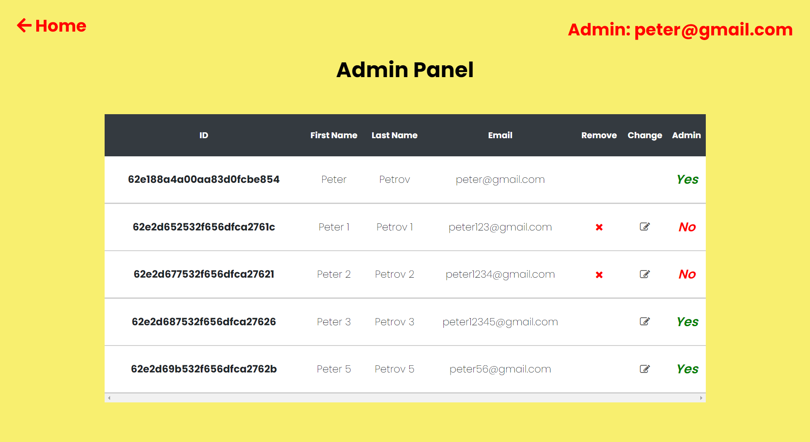

# Buildoo: Place where you can find any services

The main goal of this application is to help users to find, create or share the services with their friends or relatives if they need.
Before users create their accounts they can have a look at all the services, our team, prices and our blog. Once created an account,
they will be able to create their service, like and dislike someone's service and post a comment. After you like some service you can
find the liked services in Liked Page. You can see all created services by you in My Services Page. There is an admin page but you have to
be set as admin.

The web application has been built with MERN full-stack and it has been deployed with Heroku.

## Contents

-   [Project](#Project)
-   [Features](#Features)
-   [Technologies](#Technologies)
-   [Project Structure](#Project-Structure)
-   [How to start the project](#How-to-start-the-project)
-   [Frontend](#Frontend)
-   [Backend](#Backend)

## Project

Demo link: https://buildoo.herokuapp.com

## Features

1. Login and Register. Beautiful input validation. Many pages are only accessible for users who have access.
2. Search for a service or filter them. If you are good at something you can create your own service.
3. Create, Read , Update, Delete operations
4. Pagination, Likes and Dislikes and Comments

## Technologies

Used technologies:

-   HTML
-   CSS
-   JavaScript
-   React
-   Redux
-   Redux-toolkit
-   Nodejs
-   MongoDB Atlas
-   Google Cloud
-   Google Maps Api
-   Jest

## Project Structure

This is the structure of my project:

-   frontend
    -   public
    -   src
        -   components
        -   contexts
        -   hooks
        -   pages
        -   Redux
        -   services
        -   App.js
        -   index.js

-   backend
    -   config : configure express, mongodb and .env variables
    -   database : includes models, services and a helper file
    -   server : images uploader, services and router
    -   tests : test the backend -> **Note** Soon update

## How to start the project

> **Note**
Before run the project, you have to configure .env files in frontend and backend root folders:

You have to add:
- in frontend folder:
    - REACT_APP_GOOGLE_MAPS_API_KEY = 'Your API Key'
    
- in backend folder:
    - START_CONFIG_PORT = Your port(number)
    - START_CONFIG_USERNAME = 'Your database username'
    - START_CONFIG_PASSWORD = 'Your database password'
    - DATABASE_NAME = 'Your database name'
    - DATABASE_ADDRESS = 'Your database address'
    - DATABASE_SECRET_KEY = 'Your database secret key'

1. Configure your local mongodb cluster in /backend/config/mongoDb urlConnectionString

2. Change the environment variables with yours (follow the steps above)

3. Open:

    - frontend and install node modules with the command: npm install
    - backend and install node modules with the command: npm install

    When node modules are downloaded start the project:

    - frontend : npm start
    - backend : npm start

    The application will be running in `http://localhost:3003`

4. Enjoy!

## Frontend

### Home page

### All services and My services

### Admin panel

